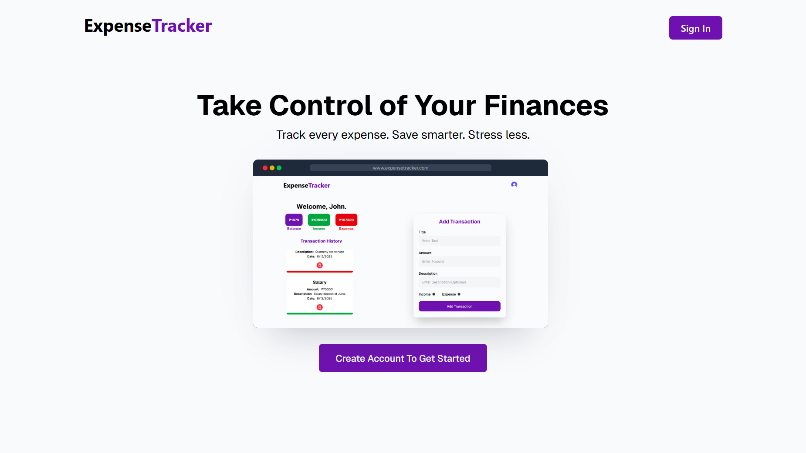
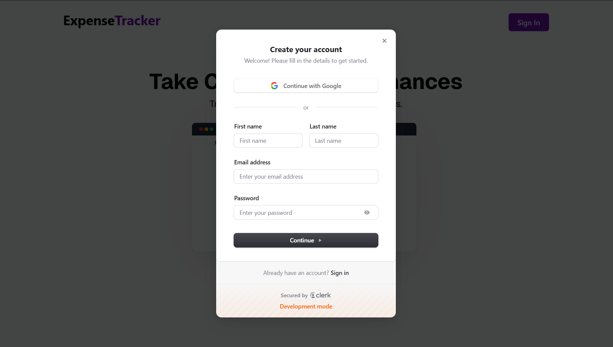
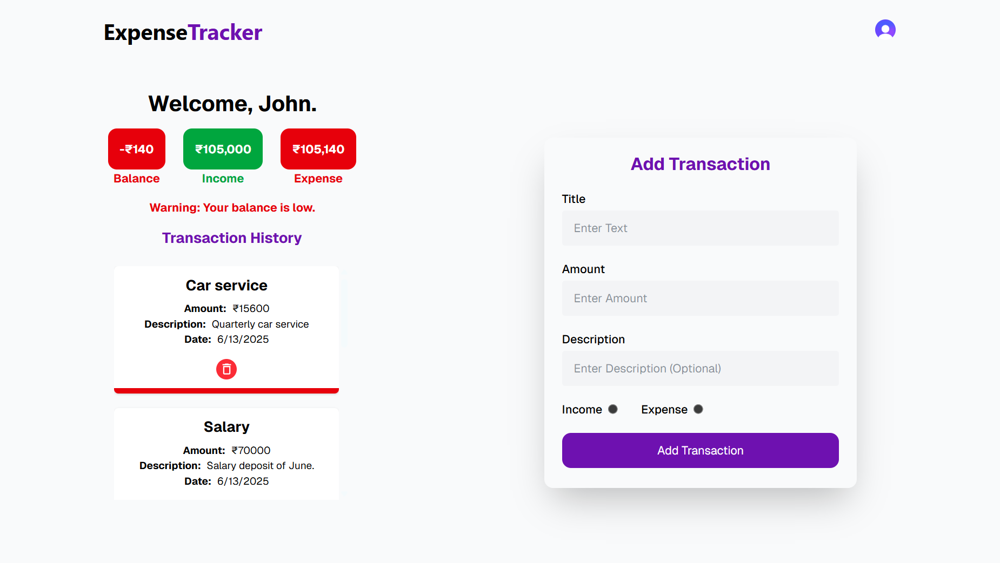
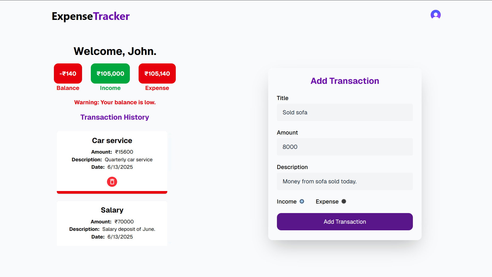
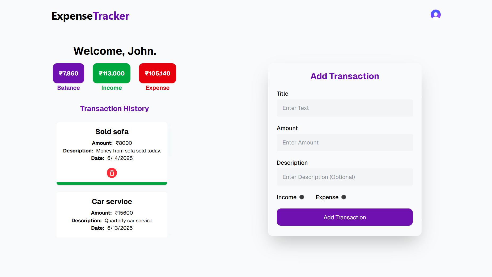

# Expense Tracker Project Using Next.js

A simple and useful expense tracker for everyday use. Users can log, view and manage their financial transactions with a clean, intuitive interface. It supports user authentication and private transaction history.

## Features
- User Authentication (via Clerk)
- Log daily transactions
- Seperate logs per users
- Good looking UI with TailwindCSS and animations

## Tech Stack
- **Frontend:** Next.js, React.js, TypeScript, JavaScript, Tailwind CSS
- **Backend:** Prisma ORM
- **Database:** PostgreSQL, Neon
- **Authentication:** Clerk

## Screenshots

 

 

 

 

